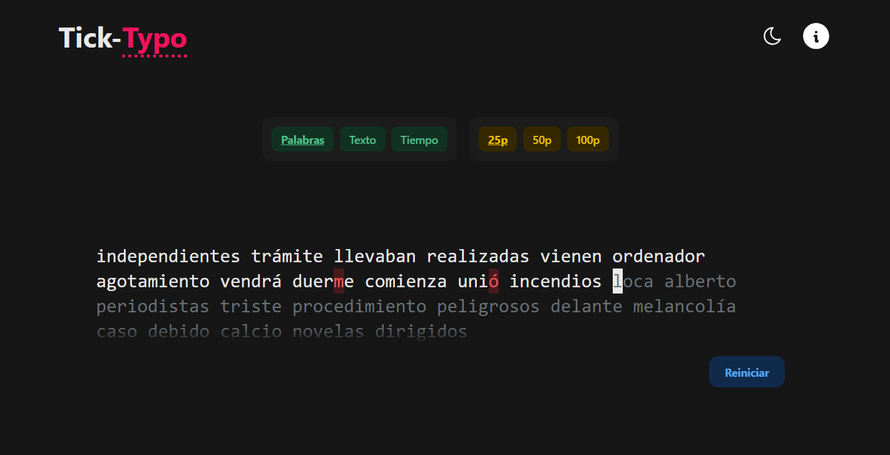

# Tick-Typo

Tyck-Typo es un pequeño proyecto creado para realizar sencillos tests (en español), de velocidad de escritura con el teclado.

## Tecnologías usadas

### Frameworks y librerías

-   [React](https://reactjs.org/)
-   [RippleUI](https://www.ripple-ui.com/)
-   [Zustand](https://zustand-demo.pmnd.rs/)

### Servicios

-   [Napkin](https://www.napkin.io/)

## Getting started

1. `git clone https://github.com/HDMC3/tick-typo.git`
2. `cd tick-typo`
3. `npm install`
4. `npm run dev`
